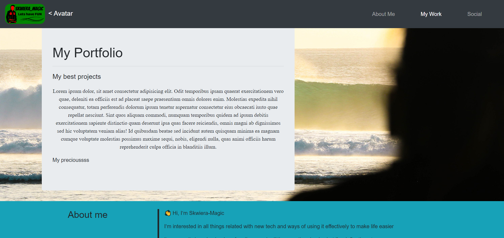

## Table of contents

- [Overview](#overview)
  - [The challenge](#the-challenge)
  - [Screenshot](#screenshot)
  - [Links](#links)
- [Author](#author)

## Overview

### The challenge

* After creating couple projects you usually want to show them somewhere. 
* So with a little nudge from outside I've created one for myself. 
* I know it's all basic so don't break my heart saying it loud to me :D

### Screenshot

* 

### Links

* You can see deployed portolio here: https://skwiera-magic.github.io/portfolio/

## Author
- Skwiera-Magic - [My GitHub](https://github.com/Skwiera-Magic/)
